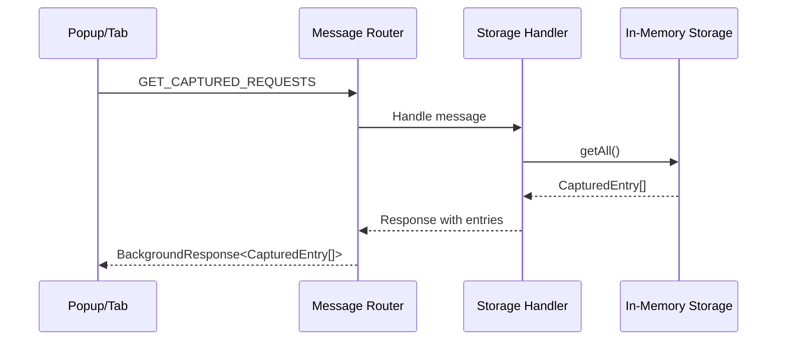
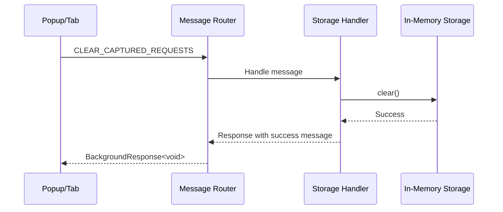
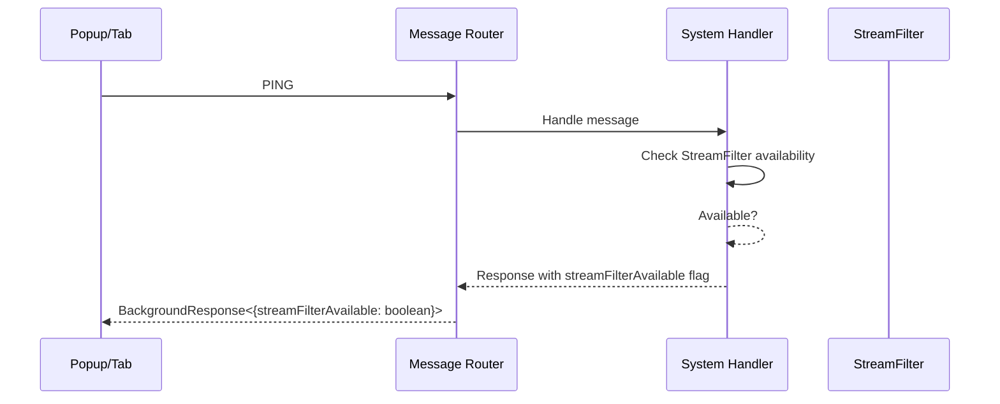

# Message Passing Contracts

**Feature**: Modular Extension Template (001-modular-extension-template)
**Date**: 2025-12-31

## Overview

This document defines the internal message passing contracts between background script and UI components (popup/tab). Messages are exchanged via `browser.runtime.sendMessage` and handled by the message router.

## Message Types

### GET_CAPTURED_REQUESTS

Request to fetch all captured HTTP requests/responses from storage.

**Request**:
```typescript
{
  type: 'GET_CAPTURED_REQUESTS'
}
```

**Response**:
```typescript
{
  success: boolean
  data?: CapturedEntry[]
  count?: number
  error?: string
}
```

**Handler**: `storage-handler.ts`

**Usage Example**:
```typescript
const response = await browser.runtime.sendMessage({
  type: 'GET_CAPTURED_REQUESTS'
});
if (response.success) {
  console.log(`Captured ${response.count} requests`);
  console.log(response.data); // CapturedEntry[]
}
```

---

### CLEAR_CAPTURED_REQUESTS

Request to clear all captured requests from storage.

**Request**:
```typescript
{
  type: 'CLEAR_CAPTURED_REQUESTS'
}
```

**Response**:
```typescript
{
  success: boolean
  message?: string
  error?: string
}
```

**Handler**: `storage-handler.ts`

**Usage Example**:
```typescript
const response = await browser.runtime.sendMessage({
  type: 'CLEAR_CAPTURED_REQUESTS'
});
if (response.success) {
  console.log('Requests cleared:', response.message);
}
```

---

### GET_STATS

Request to retrieve statistics about captured requests.

**Request**:
```typescript
{
  type: 'GET_STATS'
}
```

**Response**:
```typescript
{
  success: boolean
  data?: {
    totalEntries: number
    completedEntries: number
    pendingEntries: number
    errorEntries: number
    totalDataSize: number
    lastCaptureTime?: number
  }
  error?: string
}
```

**Handler**: `storage-handler.ts`

**Usage Example**:
```typescript
const response = await browser.runtime.sendMessage({
  type: 'GET_STATS'
});
if (response.success && response.data) {
  console.log(`Total requests: ${response.data.totalEntries}`);
  console.log(`Success rate: ${response.data.completedEntries / response.data.totalEntries * 100}%`);
}
```

---

### GET_REQUEST_BY_ID

Request to fetch a specific captured request by its ID.

**Request**:
```typescript
{
  type: 'GET_REQUEST_BY_ID'
  id: string
}
```

**Response**:
```typescript
{
  success: boolean
  data?: CapturedEntry
  error?: string
}
```

**Handler**: `storage-handler.ts`

**Usage Example**:
```typescript
const response = await browser.runtime.sendMessage({
  type: 'GET_REQUEST_BY_ID',
  id: 'req_1234567890_abc123'
});
if (response.success && response.data) {
  console.log('Request:', response.data.request.url);
}
```

---

### FILTER_REQUESTS

Request to filter captured requests by criteria.

**Request**:
```typescript
{
  type: 'FILTER_REQUESTS'
  urlPattern?: string
  method?: string
  status?: 'pending' | 'completed' | 'error'
  statusCode?: number
}
```

**Response**:
```typescript
{
  success: boolean
  data?: CapturedEntry[]
  count?: number
  error?: string
}
```

**Handler**: `storage-handler.ts`

**Usage Example**:
```typescript
const response = await browser.runtime.sendMessage({
  type: 'FILTER_REQUESTS',
  urlPattern: 'api.example.com',
  method: 'POST',
  statusCode: 200
});
if (response.success) {
  console.log(`Found ${response.count} matching requests`);
}
```

---

### GET_CONFIG

Request to retrieve current configuration.

**Request**:
```typescript
{
  type: 'GET_CONFIG'
}
```

**Response**:
```typescript
{
  success: boolean
  data?: CaptureConfig
  error?: string
}
```

**Handler**: `capture-handler.ts`

**Usage Example**:
```typescript
const response = await browser.runtime.sendMessage({
  type: 'GET_CONFIG'
});
if (response.success && response.data) {
  console.log('Max entries:', response.data.maxEntries);
}
```

---

### PING

Health check message to verify background script is running and StreamFilter is available.

**Request**:
```typescript
{
  type: 'PING'
}
```

**Response**:
```typescript
{
  success: boolean
  message?: string
  streamFilterAvailable?: boolean
}
```

**Handler**: `system-handler.ts`

**Usage Example**:
```typescript
const response = await browser.runtime.sendMessage({
  type: 'PING'
});
if (response.success) {
  console.log('Background is alive');
  if (response.streamFilterAvailable) {
    console.log('StreamFilter API is available');
  } else {
    console.warn('StreamFilter API not available - Firefox only');
  }
}
```

---

## Type Definitions

### BackgroundMessage

Union type of all possible message types.

```typescript
type BackgroundMessage =
  | { type: 'GET_CAPTURED_REQUESTS' }
  | { type: 'CLEAR_CAPTURED_REQUESTS' }
  | { type: 'GET_STATS' }
  | { type: 'GET_REQUEST_BY_ID', id: string }
  | { type: 'FILTER_REQUESTS', urlPattern?: string, method?: string, status?: string, statusCode?: number }
  | { type: 'GET_CONFIG' }
  | { type: 'PING' };
```

### BackgroundResponse<T>

Generic response wrapper for all messages.

```typescript
interface BackgroundResponse<T = unknown> {
  success: boolean
  data?: T
  message?: string
  error?: string
}
```

**Rules**:
- `success`: MUST be `true` or `false`
- If `success` is `true`:
  - `data` MAY be present (depends on message type)
  - `message` MAY be present (informational messages)
  - `error` MUST NOT be present
- If `success` is `false`:
  - `error` MUST be present (describes what went wrong)
  - `data` MUST NOT be present
  - `message` MUST NOT be present

---

## Error Handling

### Common Errors

| Error Code | Message | Handler | Resolution |
|------------|---------|----------|------------|
| `unknown_message_type` | Received message with unknown type | All handlers | Log and return error response |
| `storage_error` | Failed to access storage | storage-handler.ts | Log error and return error response |
| `invalid_id` | Invalid request ID provided | storage-handler.ts | Return success: false with error message |
| `stream_filter_unavailable` | StreamFilter API not available | capture-handler.ts | Return success: false with error message |
| `config_error` | Failed to retrieve configuration | capture-handler.ts | Log error and return error response |

### Error Response Format

All errors return the following format:

```typescript
{
  success: false,
  error: 'Descriptive error message explaining what went wrong'
}
```

**Guidelines**:
- Error messages MUST be user-friendly and actionable
- Error messages MUST NOT expose internal implementation details
- Errors MUST be logged to console for debugging

---

## Message Router Contract

### Router Interface

```typescript
interface MessageRouter {
  handle: (message: BackgroundMessage, sender: chrome.runtime.MessageSender, sendResponse: (response: unknown) => void) => void | boolean
  registerHandler: (type: string, handler: MessageHandler) => void
}
```

### Handler Registration

Handlers register with the router by message type:

```typescript
router.registerHandler('GET_CAPTURED_REQUESTS', storageHandler);
router.registerHandler('CLEAR_CAPTURED_REQUESTS', storageHandler);
router.registerHandler('GET_STATS', storageHandler);
router.registerHandler('GET_REQUEST_BY_ID', storageHandler);
router.registerHandler('FILTER_REQUESTS', storageHandler);
router.registerHandler('GET_CONFIG', captureHandler);
router.registerHandler('PING', systemHandler);
```

**Rules**:
- Each message type MUST have exactly one registered handler
- Handler functions MUST accept `ICaptureStorage` as a dependency
- Handlers MUST return responses via `sendResponse` callback
- Handlers MUST NOT throw exceptions

---

## Sequence Diagrams

### Fetch Requests Flow



### Clear Requests Flow



### Ping Flow



---

## Testing

### Message Handler Tests

For each message handler, tests MUST verify:

1. **Happy Path**: Message processed successfully, correct response returned
2. **Error Conditions**: Invalid inputs return error responses
3. **Storage Integration**: Handler correctly uses `ICaptureStorage`
4. **Error Propagation**: Errors from storage are caught and returned

### Test Example: GET_CAPTURED_REQUESTS

```typescript
describe('GET_CAPTURED_REQUESTS handler', () => {
  it('should return all captured entries', async () => {
    const mockStorage = createMockStorage([
      createMockEntry({ id: '1' }),
      createMockEntry({ id: '2' })
    ]);

    const handler = createStorageHandler(mockStorage);
    const response = await handler({ type: 'GET_CAPTURED_REQUESTS' }, mockSender, mockSendResponse);

    expect(response.success).toBe(true);
    expect(response.data).toHaveLength(2);
    expect(response.data[0].id).toBe('1');
  });

  it('should handle empty storage', async () => {
    const mockStorage = createMockStorage([]);
    const handler = createStorageHandler(mockStorage);
    const response = await handler({ type: 'GET_CAPTURED_REQUESTS' }, mockSender, mockSendResponse);

    expect(response.success).toBe(true);
    expect(response.data).toEqual([]);
    expect(response.count).toBe(0);
  });
});
```

---

## Considerations

### Performance

- Large response bodies: Message responses include full entry data; consider pagination if entries become very large
- Frequent polling: UI composables provide auto-refresh; avoid excessive GET_CAPTURED_REQUESTS calls

### Security

- Message passing is within extension (same origin)
- No additional security measures needed

### Future Extensions

Potential new message types for future features:

- `UPDATE_CONFIG`: Modify capture configuration at runtime
- `START_CAPTURE`: Begin capturing requests
- `STOP_CAPTURE`: Stop capturing requests
- `EXPORT_DATA`: Export captured data (JSON, CSV)
- `GET_HEALTH`: Extended health check with memory usage, pending request count

---

**Status**: Complete
