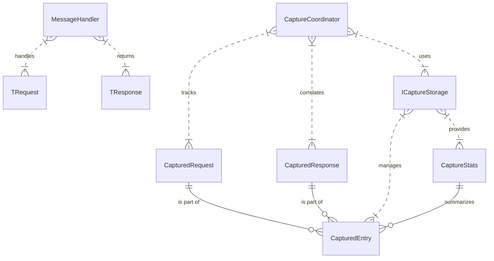
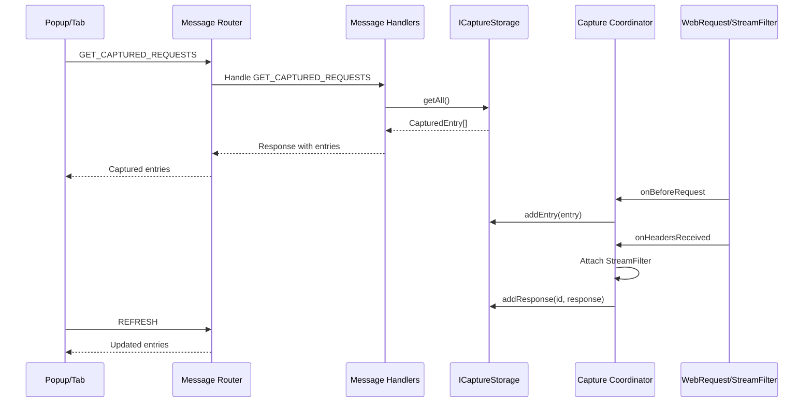

# Data Model: Modular Extension Template

**Feature**: Modular Extension Template (001-modular-extension-template)
**Date**: 2025-12-31

## Overview

This data model defines the core entities used across the modular extension template. Entities represent HTTP request/response capture and related metadata.

## Core Entities

### CapturedRequest

Represents an HTTP request that has been intercepted and is being tracked.

**Attributes**:
- **id**: `string` - Unique identifier for this request (format: `req_${timestamp}_${random}`)
- **url**: `string` - Full request URL
- **method**: `string` - HTTP method (GET, POST, PUT, DELETE, PATCH, OPTIONS, HEAD, TRACE)
- **headers**: `HttpHeaders` - Request headers as key-value pairs
- **requestBody**: `string | undefined` - Request body as string (JSON or raw text), undefined if not available
- **timestamp**: `number` - Timestamp when request was initiated (milliseconds since epoch)
- **type**: `string | undefined` - Resource type (e.g., 'xmlhttprequest', 'main_frame', 'script', 'stylesheet', 'image', 'font', 'object', 'other')

**Validation Rules**:
- `id` MUST be unique per request
- `method` MUST be uppercase
- `timestamp` MUST be positive number
- `headers` MUST be lowercase keys (for consistency)

**State Transitions**: None (immutable once created)

---

### CapturedResponse

Represents an HTTP response that has been captured via StreamFilter.

**Attributes**:
- **status**: `number` - HTTP status code (e.g., 200, 404, 500)
- **statusText**: `string` - HTTP status text (e.g., 'OK', 'Not Found', 'Internal Server Error')
- **headers**: `HttpHeaders` - Response headers as key-value pairs
- **responseBody**: `string` - Response body content as string (JSON or text)
- **timestamp**: `number` - Timestamp when response was received (milliseconds since epoch)
- **bodySize**: `number` - Size of response body in bytes

**Validation Rules**:
- `status` MUST be valid HTTP status code (100-599)
- `statusText` MUST not be empty if status is provided
- `bodySize` MUST be non-negative
- `timestamp` MUST be >= corresponding request timestamp

**State Transitions**: None (immutable once created)

---

### CapturedEntry

Represents a complete HTTP exchange (request + response) with overall capture status.

**Attributes**:
- **id**: `string` - Unique identifier (matches request.id)
- **request**: `CapturedRequest` - The request metadata
- **response**: `CapturedResponse | undefined` - The response metadata (undefined if still pending or failed)
- **status**: `'pending' | 'completed' | 'error'` - Overall capture status
- **error**: `string | undefined` - Error message if capture failed
- **createdAt**: `number` - Timestamp when entry was created
- **updatedAt**: `number` - Timestamp when entry was last updated

**Validation Rules**:
- `id` MUST match `request.id`
- `status` MUST be one of: 'pending', 'completed', 'error'
- If `status` is 'pending': `response` MUST be undefined
- If `status` is 'completed': `response` MUST be defined, `error` MUST be undefined
- If `status` is 'error': `error` MUST be defined, `response` MAY be undefined
- `updatedAt` MUST be >= `createdAt`
- Transitions MUST follow: 'pending' → ('completed' | 'error')

**State Transitions**:
1. **Created** (status: 'pending')
   - Initial state when request is intercepted

2. **Completed** (status: 'completed')
   - Valid transition from 'pending' when response received successfully

3. **Error** (status: 'error')
   - Valid transition from 'pending' when response capture fails or network error occurs

**Final States**: 'completed' or 'error' (no further transitions)

---

### CaptureStats

Represents statistics about captured requests for monitoring and diagnostics.

**Attributes**:
- **totalEntries**: `number` - Total number of captured entries
- **completedEntries**: `number` - Number of entries with 'completed' status
- **pendingEntries**: `number` - Number of entries with 'pending' status
- **errorEntries**: `number` - Number of entries with 'error' status
- **totalDataSize**: `number` - Total size of all captured response data in bytes
- **lastCaptureTime**: `number | undefined` - Timestamp of most recent capture

**Derived Values**:
- `successRate`: `number` - Percentage of completed entries (completedEntries / totalEntries * 100)
- `errorRate`: `number` - Percentage of errored entries (errorEntries / totalEntries * 100)

**Validation Rules**:
- All count values MUST be non-negative
- `totalEntries` MUST equal `completedEntries + pendingEntries + errorEntries`
- `totalDataSize` MUST be non-negative
- `successRate` MUST be between 0 and 100
- `errorRate` MUST be between 0 and 100
- If `totalEntries` is 0: `successRate` and `errorRate` MUST be 0

**State Transitions**: None (snapshot values, updated as entries are added/modified)

---

### ICaptureStorage

Interface defining operations for storing and retrieving captured entries. Enables dependency injection and storage backend swapping.

**Methods**:
- `addEntry(entry: CapturedEntry): void` - Add a new captured entry
- `updateEntry(id: string, updates: Partial<CapturedEntry>): boolean` - Update an existing entry, returns success
- `addResponse(id: string, response: CapturedResponse): boolean` - Add response data to an entry
- `markAsError(id: string, error: string): boolean` - Mark an entry as failed
- `getAll(): CapturedEntry[]` - Get all captured entries (newest first)
- `getById(id: string): CapturedEntry | undefined` - Get entry by ID
- `filter(predicate: (entry: CapturedEntry) => boolean): CapturedEntry[]` - Get entries matching predicate
- `clear(): void` - Remove all entries
- `getStats(): CaptureStats` - Get storage statistics

**Validation Rules**:
- Implementations MUST handle missing IDs gracefully (return `undefined` or `false`)
- Implementations MUST enforce entry limits and prune oldest entries
- Implementations MUST maintain insertion order for `getAll()`
- Implementations MUST be thread-safe (if applicable to extension context)

---

### MessageHandler

Function type for handling specific message types from runtime.onMessage events.

**Type Signature**:
```typescript
type MessageHandler<TRequest = unknown, TResponse = unknown> = (
  message: TRequest,
  sender: chrome.runtime.MessageSender,
  sendResponse: (response: TResponse) => void
) => void | boolean | Promise<void | boolean>
```

**Behavior**:
- Accepts message data, sender information, and response callback
- Processes message according to message type
- Returns response via callback
- Returns `true` or `Promise<true>` to keep message channel open for async response

**Validation Rules**:
- Handlers MUST handle errors gracefully
- Handlers MUST return responses in correct type
- Handlers MUST not throw exceptions (catch and return error response)

---

### CaptureCoordinator

Module that manages request lifecycle, correlation with responses, and StreamFilter attachment.

**Responsibilities**:
- Initialize webRequest listeners
- Correlate requests with responses by requestId
- Attach StreamFilter for response body capture
- Manage pending request state
- Cleanup on completion or error

**Public Methods**:
- `initialize(): void` - Start request capture
- `stop(): void` - Stop request capture and cleanup listeners
- `getPendingRequests(): Map<string, PendingRequestInfo>` - Get currently pending requests (for debugging)

**Internal State**:
- `pendingRequests`: `Map<string, PendingRequestInfo>` - Tracks requests waiting for responses
- `storage`: `ICaptureStorage` - Storage backend (dependency injected)

**Validation Rules**:
- MUST handle StreamFilter unavailability gracefully
- MUST clean up pending requests on timeout or error
- MUST not memory leak (clear Maps, remove listeners)

---

### HttpHeaders

Type alias for HTTP headers as key-value pairs.

**Type Definition**:
```typescript
type HttpHeaders = {
  [key: string]: string
}
```

**Characteristics**:
- Keys MUST be lowercase (for consistent lookup)
- Values MUST be strings
- Multiple headers with same key not supported (last one wins)

---

### PendingRequestInfo

Internal state for tracking requests that are awaiting responses.

**Attributes**:
- **entryId**: `string` - ID of the CapturedEntry
- **contentType**: `string | undefined` - Content-Type header value (used for StreamFilter)

**Validation Rules**:
- `entryId` MUST correspond to an existing CapturedEntry
- `contentType` MAY be undefined (if no Content-Type header)

---

## Relationships



**Relationship Rules**:
- **CapturedEntry** contains exactly one `CapturedRequest`
- **CapturedEntry** contains zero or one `CapturedResponse` (none if pending)
- **CaptureStats** aggregates data from all `CapturedEntry` instances
- **ICaptureStorage** manages lifecycle of all `CapturedEntry` instances
- **MessageHandler** processes one `TRequest` and returns one `TResponse`
- **CaptureCoordinator** tracks pending `CapturedRequest` instances and correlates with `CapturedResponse`
- **CaptureCoordinator** uses `ICaptureStorage` for persistence

---

## Storage Patterns

### In-Memory Storage (Default)

- Uses JavaScript `Map` for O(1) lookups
- Maintains insertion order via array
- Prunes oldest entries when limit exceeded
- No persistence (data lost on extension restart)

### Persistent Storage (Future)

- Uses `browser.storage.local` for persistence
- Maintains synchronization between in-memory cache and persistent storage
- Handles quota limits and quota exceeded errors
- Restores data on extension restart

---

## Message Flow



---

## Considerations

### Performance

- In-memory storage: Fast O(1) lookups, but limited by memory
- Large response bodies: Truncate at configured maximum size to prevent memory exhaustion
- Rapid requests: Pending request Map handles concurrent requests efficiently

### Security

- Request/response data captured from all websites by default
- Users should be aware that sensitive data is captured
- Consider adding domain filtering in configuration for privacy

### Scalability

- Entry limits prevent memory exhaustion
- Pruning removes oldest entries automatically
- Statistics aggregated efficiently without scanning all entries

---

## Validation Summary

**Consistency Checks**:
- ✅ All entities have clear validation rules
- ✅ State transitions defined where applicable
- ✅ Relationships documented
- ✅ Type signatures explicit
- ✅ No circular dependencies in type definitions

**Constitutional Compliance**:
- ✅ Typed Extensibility: All entities use TypeScript interfaces
- ✅ Module Independence: Entities in shared types/ directory, not tied to specific implementations
- ✅ WXT Build System: No framework-specific assumptions

---

**Status**: Complete
**Next**: Generate internal API contracts
